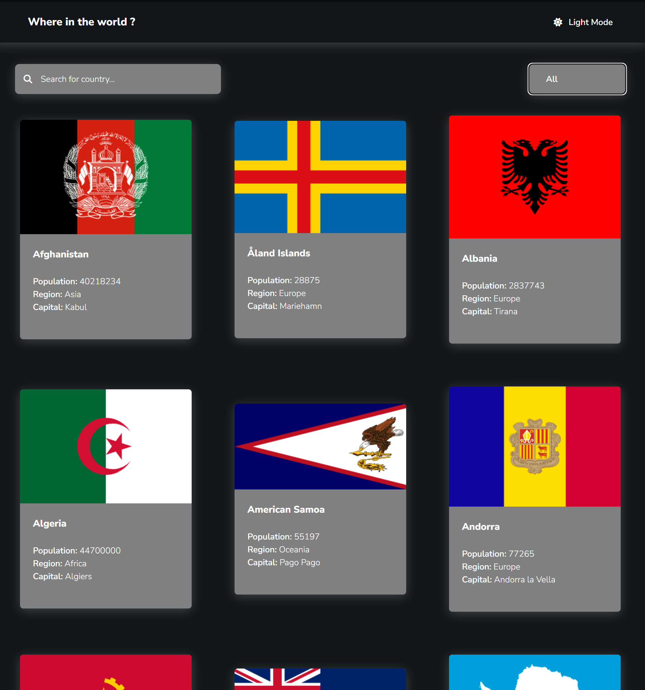
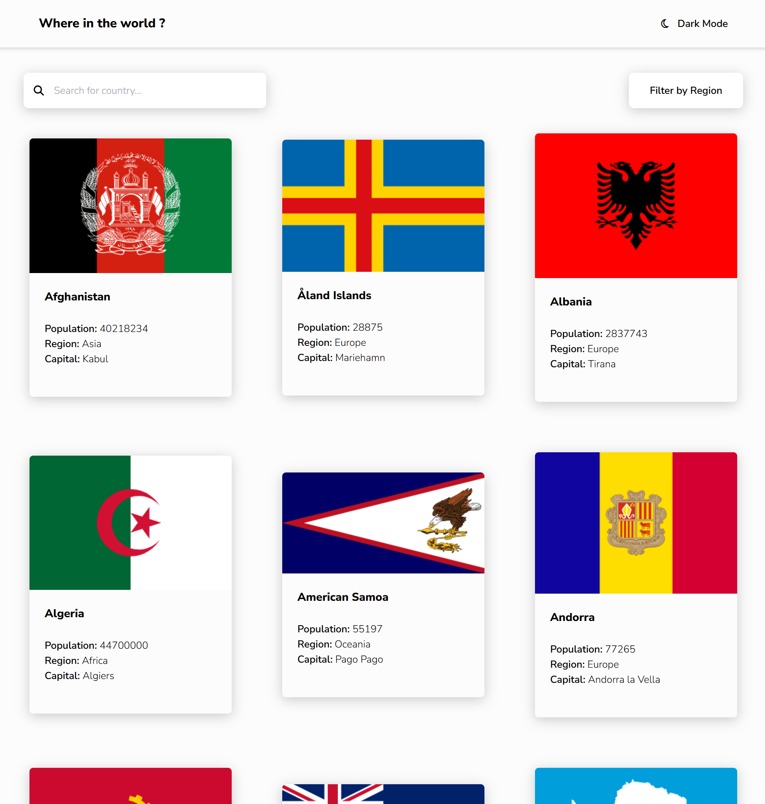

# Frontend Mentor - REST Countries API with color theme switcher solution

This is a solution to the [REST Countries API with color theme switcher challenge on Frontend Mentor](https://www.frontendmentor.io/challenges/rest-countries-api-with-color-theme-switcher-5cacc469fec04111f7b848ca). Frontend Mentor challenges help you improve your coding skills by building realistic projects. 

## Table of contents

- [Overview](#overview)
  - [The challenge](#the-challenge)
  - [Screenshot](#screenshot)
  - [Links](#links)
- [My process](#my-process)
  - [Built with](#built-with)
  - [What I learned](#what-i-learned)
  - [Continued development](#continued-development)
  - [Useful resources](#useful-resources)
- [Author](#author)
- [Acknowledgments](#acknowledgments)

**Note: Delete this note and update the table of contents based on what sections you keep.**

## Overview

### Screenshot




### Links

- Solution URL: [Add solution URL here](https://github.com/LINDECKER-Charles/FM-ArticlePreviewComponent)
- Live Site URL: [Add live site URL here](https://fm-article-preview-component-psi.vercel.app)

## My process

### Built with

- Semantic HTML5 markup
- CSS custom properties
- Flexbox
- CSS Grid
- Mobile-first workflow
- [Tailwind](https://tailwindcss.com/docs/) - JS library

### What I learned

While building this project, I reinforced several key skills:

- Configuring Tailwind CSS via CDN with an inline `tailwind.config` object.
- Importing and applying custom fonts using `@font-face` (`YoungSerif`, `Outfit`).
- Handling list numbering layout using `flex` instead of relying on `::marker` for full control:

```html
<ol class="space-y-4 mt-6">
  <li class="flex items-start gap-4">
    <span class="text-brown-800 font-bold">1.</span>
    <p class="text-stone-600"><span class="font-bold text-stone-900">Title:</span> Instruction text...</p>
  </li>
</ol>
```

## Author

- Frontend Mentor - [@LINDECKER-Charles](https://www.frontendmentor.io/profile/LINDECKER-Charles)
- Linkedine - [/in/charles-lindecker/](https://www.linkedin.com/in/charles-lindecker/)

